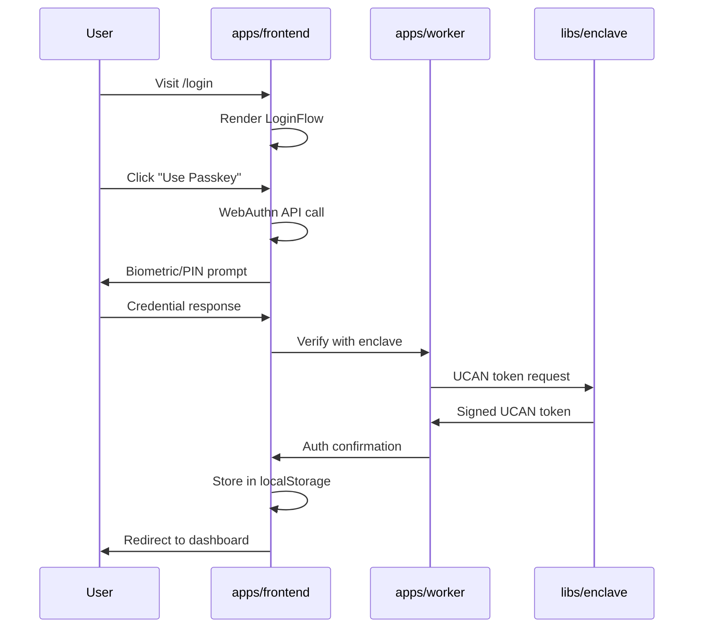
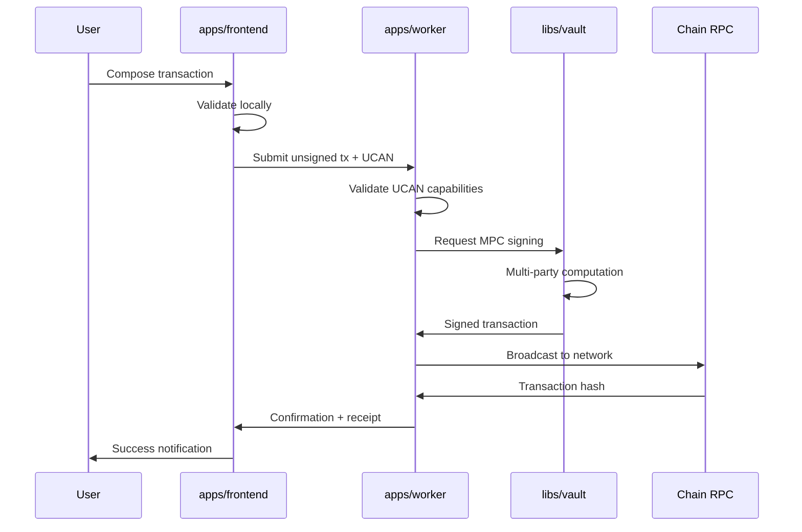
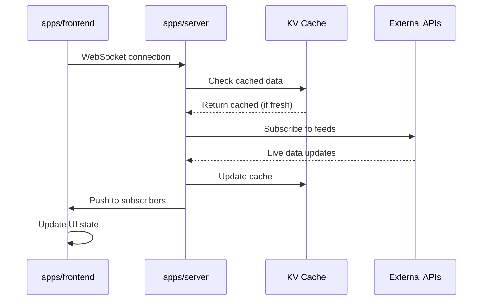

# Motr Architecture

## Table of Contents

- [Overview](#overview)
- [Three-App Architecture](#three-app-architecture)
- [Applications](#applications)
  - [apps/frontend](#appsfrontend)
  - [apps/server](#appsserver)
  - [apps/worker](#appsworker)
- [Shared Libraries](#shared-libraries)
- [Data Flows](#data-flows)
- [Build System](#build-system)
- [Deployment](#deployment)
- [Development Workflow](#development-workflow)
- [Migration Plan](#migration-plan)
- [Technology Stack](#technology-stack)
- [Security Considerations](#security-considerations)

## Overview

Motr is a WebAssembly-based monorepo providing secure cryptographic operations and decentralized identity for the Sonr ecosystem. The architecture consists of three main applications deployed as Cloudflare Workers, supported by shared libraries and tooling.

### Three-App Architecture

```
┌─────────────────┐    ┌─────────────────┐    ┌─────────────────┐
│                 │    │                 │    │                 │
│   apps/frontend │    │   apps/server   │    │   apps/worker   │
│                 │    │                 │    │                 │
│  TanStack SPA   │◄──►│  Elysia API     │◄──►│   Hono Worker   │
│  (Static Shell) │    │  (Realtime)     │    │  (Vault/Signing)│
└─────────────────┘    └─────────────────┘    └─────────────────┘
         │                       │                       │
         ▼                       ▼                       ▼
┌─────────────────┐    ┌─────────────────┐    ┌─────────────────┐
│                 │    │                 │    │                 │
│   @sonr.io/sdk  │    │   @sonr.io/ui   │    │  libs/enclave   │
│   @sonr.io/react│    │   @sonr.io/config│   │  libs/vault     │
│                 │    │                 │    │                 │
│  Client SDK     │    │  Shared UI      │    │  WASM Crypto    │
└─────────────────┘    └─────────────────┘    └─────────────────┘
```

**Communication Patterns:**
- **Frontend ↔ Server**: HTTP/WebSocket for realtime data
- **Frontend ↔ Worker**: HTTP for transactions, UCAN tokens for auth
- **Server ↔ Worker**: Service bindings for cross-worker communication
- **Worker ↔ WASM**: Direct invocation of cryptographic operations

## Applications

### apps/frontend

**Framework**: TanStack Start (SPA mode) + React + TypeScript + Vite
**Runtime**: Static hosting (CDN/Cloudflare Pages)
**Purpose**: User-facing application with WebAuthn passkey authentication

#### Responsibilities
- WebAuthn passkey registration and authentication flows
- Client-side session management (localStorage)
- Transaction composition and submission
- Real-time data subscription (prices, chain state)
- Responsive UI with Tailwind CSS + Shadcn/ui components

#### Key Features
- **SPA Mode**: Prerendered shell (`/_shell.html`) with client-side hydration
- **Zero Server Functions**: All data fetching via client-side fetch/WebSocket
- **WebAuthn Integration**: Uses `@sonr.io/sdk` for passkey flows
- **Static Deployment**: No server-side processing required
- **Client-Side Routing**: TanStack Router with 404 fallbacks to shell

#### Dependencies
- `@sonr.io/sdk`: WebAuthn, UCAN, RPC clients
- `@sonr.io/ui`: Shared UI components (Shadcn/ui primitives)
- `@sonr.io/react`: React hooks and providers
- `@sonr.io/config`: Build configuration and Vite presets

### apps/server

**Framework**: Elysia.js (Bun) + Cloudflare Workers
**Runtime**: Cloudflare Worker
**Purpose**: Realtime data aggregation and API proxying

#### Responsibilities
- Real-time price feeds via WebSocket/SSE
- Chain API proxying (Cosmos, EVM, Solana, Bitcoin)
- Rate limiting and response caching
- Data aggregation and normalization
- External API orchestration

#### Key Features
- **Realtime Updates**: WebSocket/SSE endpoints for live market data
- **API Proxying**: Secure proxy for blockchain RPC calls with authentication
- **Intelligent Caching**: KV-based caching with TTL and invalidation
- **Rate Limiting**: Prevents API abuse and manages third-party costs
- **Data Normalization**: Consistent response formats across chains

#### Endpoints
```typescript
GET  /prices/:symbol          // Cached price data
GET  /prices/stream           // WebSocket price feed
POST /chain/:network/rpc      // Proxied RPC calls
GET  /chain/:network/status   // Chain health/status
```

#### Bindings
- **KV Namespaces**: `PRICE_CACHE`, `API_RESPONSE_CACHE`
- **Durable Objects**: `PriceFeedManager` (WebSocket room management)
- **Secrets**: `COINGECKO_API_KEY`, `INFURA_API_KEY`, etc.

### apps/worker

**Framework**: Hono + Cloudflare Workers
**Runtime**: Cloudflare Worker
**Purpose**: Secure transaction signing and asset orchestration

#### Responsibilities
- Session management and authentication state tracking
- Static asset serving (built frontend bundles)
- UCAN token validation and delegation
- Transaction signing via vault/enclave WASM
- Identity management and durable object coordination
- Transaction broadcasting to blockchain networks

#### Key Features
- **Session Management**: Cookie-based sessions with KV storage and expiration
- **Asset Serving**: Static file hosting with aggressive caching and compression
- **UCAN Orchestration**: Token validation, delegation, and capability management
- **MPC Signing Pipeline**: Multi-party computation for transaction security
- **Broadcast Coordination**: Direct RPC communication with blockchain networks

#### Endpoints
```typescript
GET  /session              // Current session data
POST /session/logout       // Destroy session
POST /tx/sign             // Sign transaction via vault
POST /tx/broadcast        // Broadcast signed transaction
GET  /identity/*          // Proxy to enclave DO
POST /auth/verify-otp     // OTP verification
```

#### Bindings
- **KV Namespaces**: `SESSIONS`, `OTP_STORE`, `CHAIN_REGISTRY`, `ASSET_REGISTRY`
- **Service Bindings**: `ENCLAVE` (Durable Object), `VAULT` (HTTP server)
- **Assets**: Static file serving from `public/` directory with SPA fallbacks

## Shared Libraries

### libs/enclave

**Language**: Go (TinyGo compilation to WebAssembly)
**Output**: WASM module + TypeScript bindings + Worker client
**Purpose**: Secure identity management and cryptographic operations

#### Features
- **Durable Objects**: Persistent identity storage with global distribution
- **Web Workers**: Browser-side cryptographic isolation and background processing
- **UCAN Tokens**: Decentralized authorization with capability delegation
- **MPC Operations**: Multi-party computation for enhanced key security
- **IndexedDB**: Client-side encrypted vault persistence

#### Architecture
```
Browser Context ── Message Passing ── Web Worker ── Extism ── Go WASM
       │                                        │
       └────────────── IndexedDB (Vault) ────────┘
```

### libs/vault

**Language**: Go (TinyGo compilation to WebAssembly)
**Output**: WASM module + TypeScript bindings + Service Worker
**Purpose**: Multi-chain transaction signing and vault operations

#### Features
- **Service Worker**: Background cryptographic processing with push messaging
- **Multi-Chain Signing**: Native support for Cosmos, EVM, Solana, Bitcoin
- **Vault Persistence**: Encrypted key storage with backup/restore
- **Transaction Broadcasting**: Direct RPC communication with retry logic
- **Hardware Security**: Integration with hardware wallets and secure enclaves

#### Supported Chains
- **Cosmos SDK**: Direct integration with Cosmos Hub, Osmosis, etc.
- **EVM**: Ethereum, Polygon, Arbitrum, Optimism
- **Solana**: Native SVM program execution
- **Bitcoin**: PSBT signing and broadcast

### pkgs/sdk

**Language**: TypeScript + Web APIs
**Purpose**: Client-side SDK for Motr operations and integrations

#### Core Modules
- **WebAuthn**: Passkey registration, authentication, and credential management
- **UCAN**: Token creation, validation, delegation, and capability management
- **RPC**: Type-safe blockchain network communication (Cosmos, EVM, Solana)
- **Storage**: Encrypted client-side persistence with IndexedDB wrapper

#### Integration APIs
```typescript
// WebAuthn
const { registerWithPasskey } = await import('@sonr.io/sdk/client/auth');

// UCAN
const { createOriginToken, validateToken } = await import('@sonr.io/sdk/client/ucan');

// RPC
const { CosmosClient, EVMClient } = await import('@sonr.io/sdk/client/rpc');
```

### pkgs/ui

**Language**: TypeScript + React + Tailwind CSS
**Purpose**: Shared UI component library with blockchain-specific components

#### Component Categories
- **Primitives**: Shadcn/ui-based accessible components (Button, Input, Card, etc.)
- **Forms**: WebAuthn flows, transaction builders, wallet connections
- **Data Display**: Chain selectors, balance displays, transaction history
- **Feedback**: Loading states, error boundaries, toast notifications

#### Key Components
```typescript
import { Button, Card, Input } from '@sonr.io/ui';
import { ChainSelector } from '@sonr.io/ui/components';
import { LoginFlow, RegisterFlow } from '@sonr.io/ui/components/auth';
```

### pkgs/react

**Language**: TypeScript + React
**Purpose**: React-specific hooks, providers, and state management

#### Provider Ecosystem
- **SonrProvider**: Root context provider for SDK integration
- **AuthProvider**: WebAuthn session management and passkey state
- **QueryProvider**: TanStack Query configuration for API calls

#### Custom Hooks
```typescript
import { useSonr, useAuth, useWebAuthn } from '@sonr.io/react';
import { usePrices, useChainStatus } from '@sonr.io/react/hooks/api';
import { useTransaction } from '@sonr.io/react/hooks/transactions';
```

### pkgs/config

**Language**: TypeScript
**Purpose**: Shared build configuration, tooling, and development setup

#### Build Configuration
- **Vite Presets**: Application-specific build configurations
- **TypeScript Configs**: Consistent compiler options across workspaces
- **ESLint/Oxlint Rules**: Code quality and consistency enforcement
- **Asset Optimization**: Shared bundling strategies and optimizations

#### Development Tools
```typescript
import { createReactAppConfig } from '@sonr.io/config/vite';
import { baseTsConfig } from '@sonr.io/config/typescript';
```

## Data Flows

### Authentication Flow



**Key Steps:**
1. **Passkey Registration**: WebAuthn credential creation with user verification
2. **UCAN Issuance**: Enclave generates capability tokens for authorized actions
3. **Session Management**: Client-side storage with server-side validation
4. **Route Protection**: Automatic redirects based on authentication state

### Transaction Flow



**Security Measures:**
- **UCAN Validation**: Capability-based authorization before signing
- **MPC Signing**: Distributed key operations for enhanced security
- **Chain Validation**: Transaction verification before broadcast
- **Receipt Tracking**: Complete audit trail for all operations

### Realtime Data Flow



**Optimization Strategies:**
- **Intelligent Caching**: TTL-based cache invalidation
- **Connection Pooling**: Efficient WebSocket management
- **Data Compression**: Reduced bandwidth usage
- **Rate Limiting**: Prevent API abuse and manage costs

## Build System

### Bun Orchestrator

The monorepo uses a custom Bun-based build orchestrator (`index.ts`) that manages workspace dependencies and build ordering:

```bash
# Build all workspaces in topological order
bun run build

# Build specific workspace(s)
WORKSPACES=@sonr.io/sdk bun run build
WORKSPACES=@sonr.io/sdk,@sonr.io/ui bun run build

# Development mode (parallel dev servers)
MODE=dev bun run index.ts

# Force clean rebuild
bun run build:force

# Verbose output for debugging
VERBOSE=1 bun run build
```

#### Build Pipeline

**Dependency Graph:**
```
@sonr.io/sdk (base)
├── @sonr.io/ui
├── @sonr.io/enclave (WASM)
├── @sonr.io/vault (WASM)
├── @sonr.io/browser
├── @sonr.io/react
├── @sonr.io/config
├── apps/frontend
├── apps/server
└── apps/worker
```

**Build Order:**
1. **Base Layer**: `@sonr.io/sdk` - Core client SDK
2. **Library Layer**: `@sonr.io/ui`, `@sonr.io/enclave`, `@sonr.io/vault`
3. **Integration Layer**: `@sonr.io/browser`, `@sonr.io/react`
4. **Application Layer**: `apps/frontend`, `apps/server`, `apps/worker`

### WASM Compilation

Go libraries use Devbox for reproducible WebAssembly builds with pinned tool versions:

```bash
# Build enclave (identity/cryptography)
cd libs/enclave && devbox run wasm

# Build vault (transaction signing)
cd libs/vault && devbox run wasm

# Full build pipeline (includes WASM)
cd libs/enclave && bun run build
cd libs/vault && bun run build
```

**Devbox Environment:**
- **Go**: 1.24.7+ (standard library)
- **TinyGo**: 0.39+ (WASM compilation)
- **Binaryen**: wasm-opt for optimization
- **Extism**: Plugin runtime for WASM execution

**Build Outputs:**
- **WASM Modules**: Optimized `.wasm` files
- **TypeScript Bindings**: Generated `.d.ts` files
- **Worker Clients**: Web Worker/Service Worker wrappers

## Deployment

### Environment Configuration

#### apps/server
```bash
# External API integrations
COINGECKO_API_KEY=your_coingecko_api_key
DEFIPULSE_API_KEY=your_defipulse_api_key
COINMARKETCAP_API_KEY=your_cmc_api_key

# Blockchain RPC endpoints
COSMOS_RPC_URL=https://rpc.cosmos.network:443
ETHEREUM_RPC_URL=https://mainnet.infura.io/v3/YOUR_PROJECT_ID
SOLANA_RPC_URL=https://api.mainnet-beta.solana.com
BITCOIN_RPC_URL=https://bitcoin-rpc.publicnode.com

# Rate limiting
RATE_LIMIT_REQUESTS_PER_MINUTE=60
RATE_LIMIT_BURST_SIZE=10
```

#### apps/worker
```bash
# Runtime environment
ENVIRONMENT=production
WORKER_ENV=production

# Email service (for OTP)
EMAIL_FROM=noreply@sonr.id
RESEND_API_KEY=your_resend_api_key

# Service bindings (Cloudflare Worker names)
ENCLAVE=enclave-worker
VAULT=vault-worker
SERVER=data-server

# Security
JWT_SECRET=your_jwt_secret
SESSION_SECRET=your_session_secret
```

### Cloudflare Configuration

#### KV Namespaces
```toml
# wrangler.toml bindings
[[kv_namespaces]]
binding = "SESSIONS"
id = "your_sessions_kv_id"
preview_id = "your_sessions_preview_kv_id"

[[kv_namespaces]]
binding = "OTP_STORE"
id = "your_otp_kv_id"
preview_id = "your_otp_preview_kv_id"

[[kv_namespaces]]
binding = "CHAIN_REGISTRY"
id = "your_chain_registry_kv_id"
preview_id = "your_chain_registry_preview_kv_id"

[[kv_namespaces]]
binding = "ASSET_REGISTRY"
id = "your_asset_registry_kv_id"
preview_id = "your_asset_registry_preview_kv_id"

[[kv_namespaces]]
binding = "PRICE_CACHE"
id = "your_price_cache_kv_id"
preview_id = "your_price_cache_preview_kv_id"
```

#### Durable Objects
```toml
# wrangler.toml durable_objects
[[durable_objects.bindings]]
name = "ENCLAVE"
class_name = "EnclaveManager"

[[durable_objects.bindings]]
name = "PRICE_FEED_MANAGER"
class_name = "PriceFeedManager"

[durable_objects.classes]
EnclaveManager = "libs/enclave/src/durable-object.ts"
PriceFeedManager = "apps/server/src/price-feed-manager.ts"
```

#### Service Bindings
```toml
# Cross-worker communication
[[services]]
binding = "ENCLAVE"
service = "enclave-worker"

[[services]]
binding = "VAULT"
service = "vault-worker"

[[services]]
binding = "SERVER"
service = "data-server"
```

### Deployment Commands

```bash
# Deploy all applications
bun run deploy:all

# Deploy individual applications
cd apps/frontend && bun run deploy  # Static hosting
cd apps/server && wrangler deploy   # Worker
cd apps/worker && wrangler deploy   # Worker

# Deploy with environment
cd apps/worker && wrangler deploy --env production
```

## Development Workflow

### Local Development Setup

```bash
# Install all dependencies
bun install

# Build all workspaces (required before dev)
bun run build

# Start all development servers in parallel
bun run dev

# Individual application development
cd apps/frontend && bun run dev    # Vite dev server on :5173
cd apps/server && wrangler dev     # Worker dev on :8787
cd apps/worker && wrangler dev     # Worker dev on :8788
```

### Development Commands

```bash
# Build system
bun run build              # Full production build
bun run build:force        # Clean rebuild
VERBOSE=1 bun run build    # Verbose build output

# Development servers
bun run dev                # All apps in parallel
MODE=dev bun run index.ts  # Orchestrated dev mode

# Code quality
bun run lint              # Lint all workspaces
bun run format            # Format all code
bun run typecheck         # TypeScript checking
bun run check             # Lint + typecheck + format check

# Testing
bun run test              # Run all test suites
WORKSPACES=@sonr.io/sdk bun run test  # Test specific workspace
bun run test:watch        # Watch mode testing

# WASM development
cd libs/enclave && devbox run wasm  # Build enclave WASM
cd libs/vault && devbox run wasm    # Build vault WASM
```

### Testing Strategy

#### Unit Tests
```bash
# SDK testing
cd pkgs/sdk && vitest
cd pkgs/sdk && vitest run --coverage

# UI component testing
cd pkgs/ui && vitest
cd pkgs/ui && vitest run --ui
```

#### Integration Tests
```bash
# Worker testing
cd apps/worker && vitest
cd apps/server && vitest

# E2E testing
cd apps/frontend && playwright test
cd apps/frontend && playwright test --ui
```

#### WASM Testing
```bash
# Go tests
cd libs/enclave && go test ./...
cd libs/vault && go test ./...

# WASM execution tests
cd libs/enclave && bun run test:wasm
cd libs/vault && bun run test:wasm
```

### Debugging

#### Frontend Debugging
- **React DevTools**: Component inspection and profiling
- **TanStack Router DevTools**: Route debugging
- **Vite DevTools**: Build and HMR debugging

#### Worker Debugging
- **Wrangler DevTools**: Worker logs and request inspection
- **Cloudflare Dashboard**: Real-time metrics and error tracking
- **Durable Object Inspector**: State debugging

#### WASM Debugging
- **Chrome DevTools**: WebAssembly debugging
- **Extism Inspector**: Plugin execution tracing
- **Go Delve**: Source-level debugging

## Migration Plan

### Phase 1: Frontend Hardening ✅
- ✅ Convert to TanStack Start SPA mode with prerendered shell
- ✅ Implement WebAuthn passkey authentication flows
- ✅ Remove all server function dependencies
- ✅ Migrate to client-side fetch/WebSocket for data
- ✅ Update routing to support static deployment

**Deliverables:**
- `apps/frontend/` running as static SPA
- WebAuthn registration/login components
- Client-side session management
- Zero server function usage

### Phase 2: Server Creation (Current)
- 🔄 Scaffold `apps/server` with Elysia.js framework
- 🔄 Implement realtime price feed endpoints
- 🔄 Add blockchain RPC proxying with rate limiting
- 🔄 Set up WebSocket/SSE infrastructure
- 🔄 Configure KV caching and Durable Objects

**Deliverables:**
- `apps/server/` as deployable Cloudflare Worker
- Price data WebSocket endpoints
- Chain RPC proxy with authentication
- Rate limiting and caching middleware

### Phase 3: Worker Refinement
- 📋 Rename `apps/api` → `apps/worker` (BREAKING)
- 📋 Refocus on UCAN signing and transaction orchestration
- 📋 Optimize static asset serving with proper caching
- 📋 Enhance MPC signing pipeline
- 📋 Implement comprehensive transaction broadcasting

**Deliverables:**
- `apps/worker/` as unified signing/broadcast worker
- UCAN token validation and delegation
- Multi-chain transaction support
- Asset serving with SPA fallbacks

### Phase 4: Integration & Testing
- 📋 Define typed API clients in `@sonr.io/sdk`
- 📋 Update frontend to consume server/worker endpoints
- 📋 Implement end-to-end transaction flows
- 📋 Add comprehensive error handling and logging
- 📋 Performance testing and optimization

**Deliverables:**
- Complete API client libraries
- Integrated transaction workflows
- Error boundaries and user feedback
- Performance benchmarks

### Phase 5: Production Deployment
- 📋 Deploy all three applications to Cloudflare
- 📋 Set up monitoring, alerting, and logging
- 📋 Implement backup and disaster recovery
- 📋 Security audit and penetration testing
- 📋 Documentation and developer onboarding

**Deliverables:**
- Production deployments with CI/CD
- Monitoring dashboards and alerts
- Security audit reports
- Complete developer documentation
- User acceptance testing

### Migration Timeline

```
Week 1-2: Phase 2 (Server Creation)
Week 3-4: Phase 3 (Worker Refinement)
Week 5-6: Phase 4 (Integration & Testing)
Week 7-8: Phase 5 (Production Deployment)
```

### Risk Mitigation

- **Incremental Deployment**: Each phase can be deployed independently
- **Backward Compatibility**: Maintain API compatibility during transitions
- **Rollback Strategy**: Ability to revert to previous architecture
- **Feature Flags**: Gradual rollout with feature toggles
- **Comprehensive Testing**: Automated tests for all critical paths

## Technology Stack

### Core Runtime
- **Cloudflare Workers**: Serverless runtime for all applications
- **Bun**: Fast JavaScript runtime and package manager
- **WebAssembly**: Secure cryptographic operations

### Frameworks & Libraries
- **Frontend**: React 19 + TanStack Router + TypeScript
- **Server API**: Elysia.js (Bun-native web framework)
- **Worker API**: Hono (lightweight Cloudflare Worker framework)
- **UI Components**: Shadcn/ui + Tailwind CSS
- **State Management**: TanStack Query + React Context

### Cryptography & Security
- **WebAuthn**: Browser-native passkey authentication
- **UCAN**: Decentralized authorization tokens
- **MPC**: Multi-party computation for key operations
- **Go/TinyGo**: WASM compilation for cryptographic primitives

### Development & Build Tools
- **Build Orchestrator**: Custom Bun script (`index.ts`)
- **Bundler**: Vite with React and TypeScript plugins
- **Code Quality**: Oxlint (Rust-based ESLint alternative)
- **Environment**: Devbox (reproducible development environments)
- **Deployment**: Wrangler CLI for Cloudflare Workers

### External Integrations
- **Blockchain RPC**: Direct connections to Cosmos, EVM, Solana, Bitcoin networks
- **Price Feeds**: CoinGecko, CoinMarketCap, DeFiPulse APIs
- **Email Service**: Resend for OTP delivery
- **Storage**: Cloudflare KV, Durable Objects, R2

## Security Considerations

### Authentication & Authorization
- **WebAuthn Passkeys**: Hardware-backed, phishing-resistant authentication
- **UCAN Tokens**: Decentralized authorization with capability delegation
- **Session Management**: Secure cookie-based sessions with expiration
- **Multi-Factor**: OTP verification for sensitive operations

### Cryptographic Security
- **MPC Operations**: Distributed key operations prevent single-point failure
- **WASM Isolation**: Cryptographic operations in sandboxed WebAssembly environment
- **Hardware Security**: Integration with hardware wallets and secure enclaves
- **Key Derivation**: PBKDF2-based key derivation with high iteration counts

### Network & Infrastructure Security
- **Service Bindings**: Secure inter-worker communication without exposed endpoints
- **Rate Limiting**: API abuse prevention and cost management
- **Request Validation**: Comprehensive input validation and sanitization
- **CORS Policies**: Strict cross-origin resource sharing controls

### Data Protection
- **Encryption at Rest**: Sensitive data encrypted in KV namespaces
- **TLS Everywhere**: All communications use TLS 1.3
- **Secure Headers**: Comprehensive security headers (CSP, HSTS, etc.)
- **Audit Logging**: Complete audit trails for all security events

### Operational Security
- **Zero-Trust Architecture**: Every request validated and authorized
- **Principle of Least Privilege**: Minimal permissions for all operations
- **Regular Updates**: Automated dependency updates and security patches
- **Incident Response**: Comprehensive logging and monitoring for threat detection
